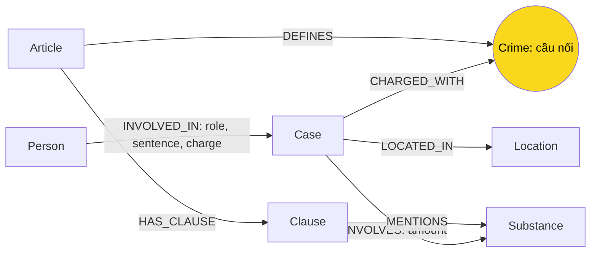

# Thiết kế Ontology — Day 19

**Họ tên:** Nguyễn Văn Hưởng  **MSSV:** 2A202602743

**Lựa chọn:**
- [x] Dùng ontology gợi ý (có thể chỉnh nhỏ)
- [ ] Tự thiết kế (xét bonus +15)

## 1. Sơ đồ

## 2. Entity types (node labels)

| Label | Ý nghĩa | Khóa định danh | Properties | KB | Trích bằng |
| --- | --- | --- | --- | --- | --- |
| Article | Một Điều luật | id | id, title, law, doc_id | Luật | Metadata + regex |
| Clause | Một khoản trong Điều luật | id | id, number, penalty, text, doc_id | Luật | Regex |
| Crime | Tội danh chuẩn, cầu nối chính | name | name | Cả hai | Tiêu đề luật + LLM, link_entity |
| Case | Vụ việc được báo mô tả | name | name, summary, date, source_title, doc_id | Tin tức | LLM |
| Person | Người tham gia vụ việc | name | name, aliases, doc_id | Tin tức | LLM |
| Substance | Chất ma túy | name | name | Cả hai | Danh sách chuẩn + regex/LLM |
| Location | Địa điểm vụ việc | name | name, doc_id | Tin tức | LLM |

Article, Clause, Case mang doc_id của tài liệu tạo node. Person và Location giữ doc_id đầu tiên khi xuất hiện lại; cạnh tới từng Case cho phép lần về nguồn vụ việc. Crime và Substance là từ vựng dùng chung, không gắn một doc_id duy nhất. Đây là giới hạn truy vết: doc_id trên node dùng chung không đại diện đầy đủ mọi nguồn.

## 3. Relationships

| Type | Từ → Đến | Properties | Ý nghĩa |
| --- | --- | --- | --- |
| DEFINES | Article → Crime | Không | Điều luật định nghĩa tội danh |
| HAS_CLAUSE | Article → Clause | Không | Điều chứa khoản |
| MENTIONS | Clause → Substance | Không | Khoản nhắc đến chất |
| CHARGED_WITH | Case → Crime | Không | Vụ việc có tội danh được bài báo đề cập |
| INVOLVES | Case → Substance | amount | Chất và khối lượng dạng chuỗi trong vụ |
| LOCATED_IN | Case → Location | Không | Địa điểm vụ việc |
| INVOLVED_IN | Person → Case | role, sentence, charge | Vai trò, mức án thực tế, tội danh của từng người |

CHARGED_WITH tổng hợp ở cấp vụ việc; không có nghĩa mọi người trong vụ đều bị truy tố cùng tội. Khi trả lời về một người, cần đọc thêm INVOLVED_IN.charge, role và văn bản nguồn. Mức án thực tế trên cạnh INVOLVED_IN khác khung hình phạt trong Clause.text.

## 4. Node cầu nối giữa 2 KB

- **Node chính:** Crime; Substance hỗ trợ nối và lọc khoản luật.
- **Vì sao:** tin nêu hành vi/tội danh; luật định nghĩa tội ở tiêu đề Điều. Đường Case → Crime ← Article đưa thông tin luật vào câu hỏi về người trong báo.
- **Khớp tên:** trích luật trước để lập danh sách chuẩn; đưa danh sách vào prompt trích tin. link_entity chuẩn hóa hai phía, khớp chính xác trước rồi dùng difflib với ngưỡng 0,8; trả về cách viết gốc trong danh sách chuẩn.
- **Khi cầu gãy:** tội danh ngoài corpus luật, trích xuất bỏ sót hoặc tên quá khác. Không ép nối tên không đủ giống; giữ vụ để kiểm tra bằng Cypher và đối chiếu bài gốc. JSON không hợp lệ thì dừng với doc_id cụ thể thay vì âm thầm bỏ bài.

## 5. Competency questions

| Câu | Đường đi (Cypher pattern) | Trả lời được? |
| --- | --- | --- |
| Q1 | `(Article {id:'Điều 2 Luật PCMT'})-[:HAS_CLAUSE]->(Clause {number:4})` | Khi vector lấy trúng Điều 2, context lấy các khoản định nghĩa; không có node riêng cho tiền chất. |
| Q2 | `(Person)-[r:INVOLVED_IN]->(Case)` với `r.sentence = 'tử hình'` | Có nếu trích được đúng vụ 36kg và mức án từng người. |
| Q3 | `(Person {name:'Lê Minh Thành'})-[:INVOLVED_IN]->(Case)-[:CHARGED_WITH]->(Crime)<-[:DEFINES]-(Article)-[:HAS_CLAUSE]->(Clause {number:1})` | Có: mức án từ tin, tội và khung cơ bản từ luật. |
| Q4 | `(Person)-[:INVOLVED_IN]->(Case)-[:CHARGED_WITH]->(Crime)<-[:DEFINES]-(Article)-[:HAS_CLAUSE]->(Clause)`; seed qua alias Hoàng Nato | Câu hỏi tối đa/cao nhất/nặng nhất được mở mọi khoản, tránh bỏ khoản 4 Điều 255. |
| Q5 | `(Person)-[:INVOLVED_IN]->(Case)-[:INVOLVES {amount}]->(Substance {name:'MDMA'})<-[:MENTIONS]-(Clause)<-[:HAS_CLAUSE]-(Article)`; kiểm tra tội qua Crime | Graph chứa khối lượng và text khoản; LLM phải đối chiếu ngưỡng. Không có suy luận định lượng tự động. |
| Q6 | `(Case)-[:INVOLVES]->(Substance {name:'MDMA'})` | Seed theo tên chất tìm mọi vụ liên quan trong graph; phụ thuộc độ đầy đủ trích xuất và giới hạn context. |

Không đọc gold hoặc must_include để dựng graph hay chọn câu trả lời. Các đường đi trên mô tả thiết kế cho câu hỏi kiểm chứng; context dùng quy tắc tổng quát: tài liệu vector, tên/alias, chất, số Điều và yêu cầu mức phạt.

## 6. Quyết định thiết kế và đánh đổi

1. **Crime làm cầu nối.** Có thể nối trực tiếp Case → Article, nhưng Crime giúp chuẩn hóa hành vi giữa báo và luật. Đổi lại, lỗi chuẩn hóa có thể làm gãy cầu hoặc gán nhầm tội gần giống.
2. **Regex cho luật, LLM cho tin.** Có thể dùng LLM cho tất cả, nhưng regex giảm chi phí và giữ nguyên text khoản. Đổi lại, parser phụ thuộc định dạng số khoản; tin vẫn có rủi ro LLM bỏ sót hoặc diễn giải sai.
3. **Mức án/khối lượng là property.** Có thể thêm node Sentence/Quantity và ngưỡng gram, nhưng mẫu giữ graph đơn giản. Đổi lại, không tự cộng khối lượng hay kiểm chứng điều kiện áp dụng khoản.
4. **Khóa name cho Person, Case, Location, Substance.** Có thể dùng khóa hồ sơ hoặc khóa tài liệu/vụ án ổn định, nhưng cần giải quyết đồng nhất thực thể. Khóa name dễ tạo node trùng khi tên khác nhau và dễ gộp nhầm người trùng tên.
5. **Giới hạn context 60 dữ kiện.** Ưu tiên tóm tắt vụ và khoản luật rồi tới cạnh một bước. Đổi lại, truy vấn rộng có thể mất dữ kiện. Câu hỏi mức phạt tối đa mở mọi khoản của Điều liên quan để giảm thiếu khung cao nhất.

## 7. So với ontology gợi ý

Không đăng ký bonus. Giữ nguyên 7 labels và 7 relationships. Chỉnh nhỏ: thêm doc_id cho Person/Location, hợp nhất aliases khi cập nhật Person, kiểm tra JSON trích xuất, và mở các khoản khi hỏi mức phạt tối đa. Không tính các chỉnh sửa này là ontology tự thiết kế.

## 8. Hạn chế còn lại

- Không mô hình hóa giai đoạn tố tụng hay phiên bản luật áp dụng theo thời điểm.
- Không chuẩn hóa toàn diện tên người, vụ án và tên chất đồng nghĩa.
- Bài có thể chứa phần gợi ý đọc tiếp; LLM có thể trích thêm vụ từ phần đó.
- Khối lượng ở cấp vụ không tách trách nhiệm từng người hay từng lần vận chuyển.
- MENTIONS chỉ ghi nhận tên chất, không biểu diễn điều kiện định lượng.
- Kết quả kỹ thuật dựa trên corpus lab BLHS 2015 sửa đổi 2017, không phải kết luận pháp lý hiện hành.
