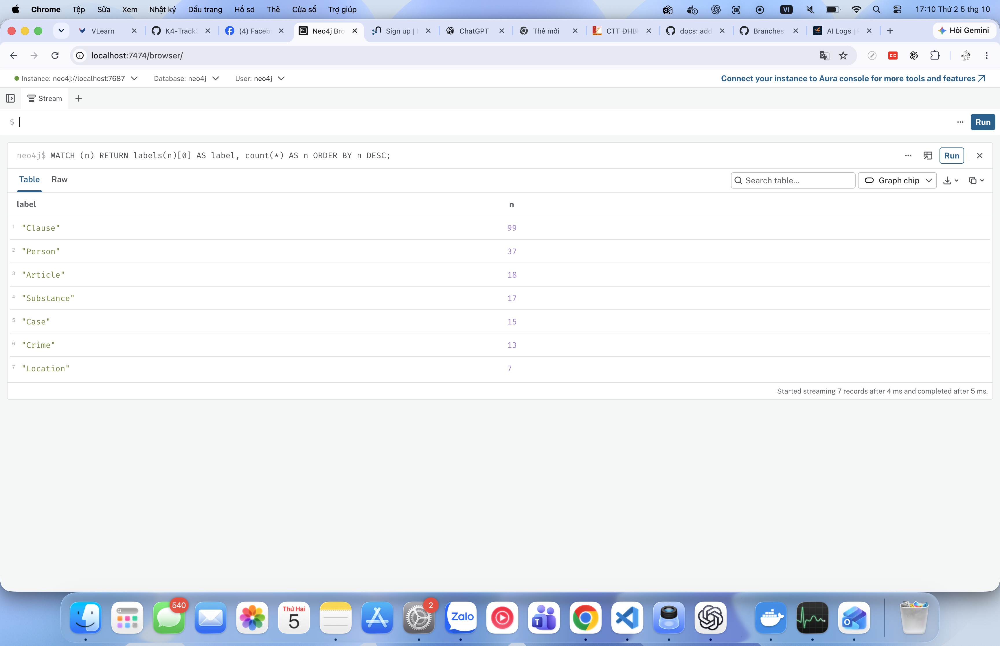
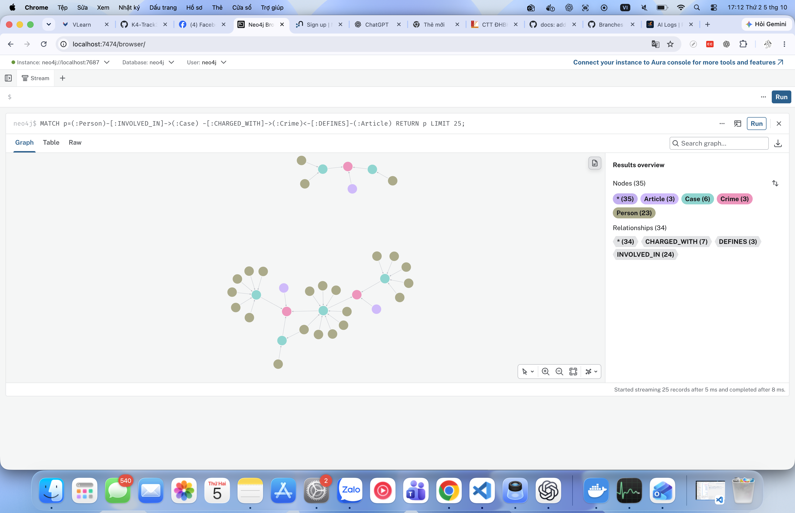
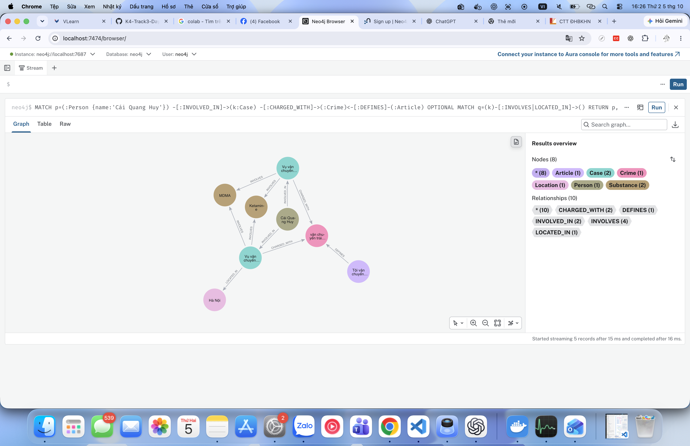

# Báo cáo Day 19 — Flat RAG vs GraphRAG

**Họ tên:** Nguyễn Văn Hưởng  **MSSV:** 2A202602743  **Ngày:** 05/10/2026

Dùng ontology gợi ý, không đăng ký bonus. Kết quả bên dưới được sinh bởi `python bench_kg.py --judge`, giữ nguyên file benchmark và bộ test của lab. Bản thiết kế: [ONTOLOGY.md](ONTOLOGY.md). Kết quả gốc: [ket_qua_benchmark_kg.txt](../ket_qua_benchmark_kg.txt).

Cấu hình chung: OpenAI `gpt-4o-mini`, embedding `text-embedding-3-small`, `top_k=3`, `chunk_size=800`. Corpus gồm 18 Điều luật và 20 bài báo, chia thành 176 chunk. Graph cuối cùng có **206 node / 384 cạnh**. Báo cáo dùng lần chạy đầy đủ mới nhất sau khi chạy lại; không trộn số liệu của lần trước. Mỗi câu được đo một lượt ở mỗi pipeline trong lần này; kết quả phụ thuộc trích xuất LLM và thời gian phản hồi API, chưa phải ước lượng thống kê trên nhiều lần chạy.

## 1. Chi phí

Hai bảng nguyên văn từ file benchmark:

```text
== Indexing (one-off)
pipeline  calls    in_tok  out_tok       USD  seconds
flat        176     56072        0   0.00112    125.0
graph       196     91958     4899   0.00944    206.7

== Querying (mean per question)
pipeline  recall  judge   in_tok  out_tok       USD  seconds
flat        0.43   1.00      694       47   0.00013     2.68
graph       0.89   1.83     5077       79   0.00080     4.10
```

| Chỉ số | Flat | Graph | Graph / Flat |
| --- | ---: | ---: | ---: |
| Indexing USD | 0,00112 | 0,00944 | 8,43× |
| Indexing giây | 125,0 | 206,7 | 1,65× |
| Mỗi câu: USD | 0,00013 | 0,00080 | 6,15× |
| Mỗi câu: giây | 2,68 | 4,10 | 1,53× |
| Mỗi câu: in_tok | 694 | 5.077 | 7,32× |

Tỉ lệ được tính từ số đã làm tròn trong file kết quả, nên chỉ là xấp xỉ. Graph indexing gồm **cùng vector index của Flat + dựng KG**; không cộng hai dòng indexing để tính tiền thực trả của một lần chạy. Phần dựng KG tăng thêm 20 lượt chat, 35.886 input token, 4.899 output token, khoảng **0,00832 USD và 81,7 giây**. Luật được trích bằng regex; các lượt chat tăng thêm đến từ 20 bài báo.

Khi truy vấn, GraphRAG thêm tóm tắt vụ, cạnh và khoản luật vào prompt, làm input tăng từ 694 lên 5.077 token trung bình. Cả hai pipeline đều tính embedding câu hỏi và sinh câu trả lời. Các lượt LLM-as-judge được gọi sau khi chốt usage của từng pipeline nên **không nằm trong hai bảng chi phí**; tiền judge và lần `--check` vẫn có thể phát sinh trên tài khoản API.

Đơn giá trong `src/llm.py` là 0,15 USD/triệu input token và 0,60 USD/triệu output token cho [GPT-4o mini](https://developers.openai.com/api/docs/models/gpt-4o-mini), 0,02 USD/triệu token cho [text-embedding-3-small](https://developers.openai.com/api/docs/models/text-embedding-3-small), đối chiếu tài liệu OpenAI ngày 05/10/2026. Đây là ước tính theo bảng giá chuẩn của mã nguồn, không phải hóa đơn: bộ đo chưa tách giảm giá cached input, thuế, hạ tầng Docker hay công thiết kế.

**Điểm hòa vốn về tiền:** với cùng corpus và chi phí truy vấn trung bình hiện tại, `C_flat(N) ≈ 0,00112 + 0,00013N`, `C_graph(N) ≈ 0,00944 + 0,00080N` USD. Graph cao hơn ở cả hai thành phần nên không có N ≥ 0 khiến Graph rẻ hơn Flat. Muốn đánh giá hòa vốn theo giá trị sử dụng cần thêm giá trị của một câu trả lời đúng hoặc chi phí sửa câu trả lời sai; thí nghiệm này chưa đo đại lượng đó.

## 2. Từng câu hỏi

Recall là tỉ lệ từ khóa bắt buộc xuất hiện nguyên văn, không phải độ chính xác ngữ nghĩa. Judge là điểm LLM 0–2 theo đáp án chuẩn.

| Câu | Loại | Flat recall / judge | Graph recall / judge | Thắng về chất lượng | Vì sao |
| --- | --- | --- | --- | --- | --- |
| Q1 | single-hop-law | 1,00 / 2 | 1,00 / 2 | Hòa | Cả hai lấy được định nghĩa tiền chất; Graph bổ sung Điều 2 khoản 4. |
| Q2 | single-hop-news | 1,00 / 2 | 1,00 / 2 | Hòa | Danh tính hai người nhận án nằm ngay trong bài báo. |
| Q3 | cross-kb | 0,00 / 0 | 1,00 / 2 | Graph | Flat không đủ thông tin; Graph nối Lê Minh Thành tới Điều 251 và khung cơ bản. |
| Q4 | cross-kb | 0,00 / 0 | 1,00 / 2 | Graph | Alias Hoàng Nato nối được sang Điều 255; mở mọi khoản khi hỏi tối đa lấy được chung thân. |
| Q5 | cross-kb-multi-hop | 0,60 / 1 | 1,00 / 2 | Graph | Flat viết “khoản b)” và thiếu số Điều; Graph xác định Điều 250 khoản 4. |
| Q6 | aggregation | 0,00 / 1 | 0,33 / 1 | Graph hơn recall, hòa judge | Graph nhắc đủ tên Thành, không nêu tên Huy, bỏ Viện Pháp y và đưa vụ 36kg vào danh sách MDMA thiếu bằng chứng. |

Trên riêng Q3–Q5, recall trung bình của Flat là 0,20 và Graph là 1,00; judge tương ứng 0,33 và 2,00. Với Q1–Q2, chất lượng ngang nhau nên Flat có lợi thế chi phí/độ trễ. Q6 cho thấy tăng khả năng truy xuất không tự bảo đảm một danh sách đầy đủ và không trùng.

Ở Q5, điểm judge=2 vẫn cần đọc thận trọng: câu trả lời Graph tập trung MDMA và không nhắc khoảng 406g Ketamine trong gold. Không coi judge là bằng chứng mọi chi tiết đều hoàn hảo.

## 3. Phân tích lỗi

Bằng chứng được đọc từ graph đầy đủ sau benchmark. [graph_audit.json](validation/graph_audit.json) lưu Cypher, kết quả và snapshot node/cạnh. Có thể tái thu bằng `python scripts/audit_kg.py` mà không gọi LLM hay thay đổi graph.

### Lỗi E3: Trùng thực thể do dùng tên làm khóa

- **Hiện tượng:** graph tạo hai node cho cùng tên chất khác hoa/thường; cùng vụ Cái Quang Huy xuất hiện dưới hai tên vụ khác nhau.
- **Bằng chứng về chất:** truy vấn trong mục `substances` của file audit:

```cypher
MATCH (s:Substance)
RETURN s.name AS name ORDER BY toLower(s.name);
```

Trích các dòng trong kết quả:

```text
Ketamine
ketamine
methamphetamine
Methamphetamine
```

- **Bằng chứng về vụ:** truy vấn tương ứng mục `repeated_person_cases`:

```cypher
MATCH (p:Person)-[:INVOLVED_IN]->(k:Case)
WITH p, collect(DISTINCT {name:k.name, doc_id:k.doc_id}) AS cases
WHERE size(cases) > 1
RETURN p.name AS person, p.aliases AS aliases, cases ORDER BY person;
```

Dòng `Cái Quang Huy` có hai vụ:

| name | doc_id |
| --- | --- |
| Vụ vận chuyển ma túy từ Đức về Việt Nam | news-100260917203001265 |
| Vụ vận chuyển ma túy của Cái Quang Huy | news-100260918080821054 |

Đối chiếu [bài về Huy](../data/drug_news/news-100260917203001265.md) và đoạn cuối [bài về Thành](../data/drug_news/news-100260918080821054.md): đều đề cập Huy, tuyến Đức–Nội Bài, hơn 9,6kg MDMA và gần 406g Ketamine. Đoạn cuối bài về Thành đưa tin liên quan về Huy vào cùng văn bản, nên LLM tạo thêm Case. Đây là cùng thông tin vụ việc được đặt hai tên, không phải bằng chứng về hai vụ độc lập.

- **Nguyên nhân:** `MERGE` phân biệt hoa/thường và `Case.name` do LLM tự đặt. Danh sách tên chất chuẩn trong prompt không được kiểm chứng lại bằng code; `link_entity` hiện chỉ áp dụng cho tội danh. Phần văn bản gợi ý đọc tiếp chưa được tách khỏi bài chính.
- **Đề xuất sửa:** thêm chuẩn hóa Unicode/hoa-thường và bảng alias Substance trước khi ghi Neo4j; tách phần bài liên quan khi crawl. Với Case, thêm bước hợp nhất có kiểm chứng theo người, thời điểm, địa điểm và nguồn; không gộp chỉ vì cùng người. Đổi lại, cần quản lý provenance nhiều tài liệu và có nguy cơ gộp nhầm hai vụ thật. Đây là hướng sửa tiếp, chưa áp dụng trong benchmark đang báo cáo.

### Lỗi E5: Câu tổng hợp thiếu dữ kiện và thêm vụ không có bằng chứng MDMA

- **Hiện tượng:** Q6 Graph bỏ vụ Viện Pháp y tâm thần dù graph có cạnh MDMA, không nêu đầy đủ tên Cái Quang Huy và đưa vụ mua bán hơn 36kg vào danh sách MDMA dù graph chỉ ghi chất là “ma túy”.
- **Bằng chứng từ câu trả lời Q6 Graph:**

> 1. Vụ góp tiền mua ma túy tại Hà Nội: Trong vụ này, có 5 viên ma túy MDMA bị thu giữ từ Lê Minh Thành.
> 2. Vụ vận chuyển ma túy từ Đức về Việt Nam: Trong vụ này, tổng khối lượng MDMA là 9,6kg.
> 3. Vụ mua bán hơn 36kg ma túy tại TP.HCM: Mặc dù không có thông tin cụ thể về loại ma túy, nhưng vụ việc này cũng liên quan đến ma túy.

Toàn bộ câu trả lời được giữ trong file benchmark. Cypher đối chiếu (mục `mdma_cases` trong audit):

```cypher
MATCH (k:Case)-[r:INVOLVES]->(s:Substance)
WHERE toLower(s.name) = 'mdma'
OPTIONAL MATCH (p:Person)-[:INVOLVED_IN]->(k)
RETURN k.name AS case_name, k.doc_id AS doc_id, r.amount AS amount,
       collect(DISTINCT p.name) AS people
ORDER BY case_name;
```

| case_name | doc_id | amount |
| --- | --- | --- |
| Vụ góp tiền mua ma túy tại Hà Nội | news-100260918080821054 | 5 viên |
| Vụ tổ chức sử dụng ma túy tại Sầm Sơn | news-100260930085028036 | 0,686g |
| Vụ vận chuyển ma túy của Cái Quang Huy | news-100260918080821054 | 9,6kg |
| Vụ vận chuyển ma túy từ Đức về Việt Nam | news-100260917203001265 | 9.6kg |
| Vụ án tại Viện Pháp y tâm thần Trung ương | news-100260924105118645 | (rỗng) |

Riêng [bài về vụ 36kg](../data/drug_news/news-100260928173914514.md) chỉ ghi ma túy các loại, không xác định MDMA. Snapshot audit có cạnh `INVOLVES(amount="36kg")` tới Substance `ma túy`, không có cạnh tới `MDMA`; đây là bằng chứng câu trả lời thêm một vụ không được nguồn hiện tại hỗ trợ, không phải khẳng định vụ thật không chứa MDMA.

Năm Case node không đồng nghĩa năm vụ độc lập: có trùng Huy và các diễn biến liên quan Viện Pháp y. Đối chiếu bài `news-100260930085028036`, 0,686g MDMA được thu ở buồng chữa bệnh, trong khi tên Case nhấn vào Sầm Sơn. Việc dồn nhiều diễn biến vào một Case còn có thể làm lệch địa điểm của khối lượng.

- **Nguyên nhân xác định được:** bước trả lời chưa kiểm tra điều kiện loại chất của từng vụ, và chưa bảo đảm bao phủ danh sách vụ liên quan tới Substance; `context()` ưu tiên summaries và các khoản luật, giới hạn cạnh một bước và tổng số facts. Summary vụ Viện Pháp y tập trung vào chạy giám định, không nhắc MDMA. Lần benchmark không lưu nguyên prompt, nên chưa thể phân biệt chắc chắn cạnh MDMA bị loại khi đóng gói context hay LLM bỏ qua cạnh đã nhận; không quy toàn bộ lỗi cho LLM.
- **Đề xuất sửa:** với câu liệt kê theo chất, dùng truy vấn Case–INVOLVES–Substance chuyên biệt, đưa mỗi dòng đủ tên vụ, nguồn, người và chất vào prompt; giảm các khoản luật không cần thiết. Hợp nhất Case có kiểm chứng trước khi tổng hợp và kiểm tra tập vụ được nhắc sau sinh, chỉ giữ vụ có bằng chứng về đúng chất đang hỏi. Đổi lại, cần định tuyến loại câu hỏi và kiểm tra coverage, danh sách dài có thể cần phân trang. Cần chạy lại benchmark và lưu prompt sau thay đổi để chứng minh hiệu quả; báo cáo này chưa tuyên bố đã sửa hết lỗi.

### Lỗi E4: Recall theo chuỗi không phản ánh đầy đủ nội dung

- **Hiện tượng:** Q6 Flat có recall=0,00 nhưng judge=1 và chứa một phần thông tin đúng.
- **Bằng chứng:** câu trả lời có “Vụ việc của Thành liên quan đến 5 viên nén màu trắng được xác định là ma túy MDMA”, trong khi từ khóa bắt buộc là `Lê Minh Thành`. Tương tự, câu trả lời nói “Đông” và buồng chữa bệnh nhưng không có chuỗi `Pháp y tâm thần`. Bộ đo không ghi nhận các cách nhắc tắt này.
- **Nguyên nhân:** `keyword_recall` chỉ kiểm tra `keyword.lower() in answer.lower()`. Điểm 0 ở đây là không trúng các chuỗi chuẩn, không có nghĩa mọi thông tin trong câu đều sai. Tuy vậy, tên tắt thiếu rõ ràng và cách nói “vụ của Đức” cũng không đủ để coi Flat đã trả lời hoàn chỉnh.
- **Đề xuất sửa:** bổ sung một chỉ số ngoài benchmark chuẩn, chấm các bộ sự kiện/người/vụ có kiểm chứng alias và nguồn, kết hợp kiểm tra thủ công. Giữ nguyên benchmark của lab để so sánh; chỉ số mới cần thêm nhãn và công đánh giá, có nguy cơ gộp nhầm tên tắt.

### Quan sát bổ sung: Không phải mọi cầu nối thiếu đều là lỗi

Audit `no_bridge` trả về “Vụ tông cảnh sát giao thông ở An Giang” (`news-100260926112415229`) và Case trùng “Vụ vận chuyển ma túy của Cái Quang Huy” (`news-100260918080821054`). Case Huy này thiếu charge nên chưa nối tới Crime, trong khi Case Huy từ bài chính vẫn có cầu tới Điều 250; đây là hạn chế trích xuất ở bản trùng. Với vụ An Giang, Cần phân biệt tội ngoài phạm vi 13 tội danh ma túy trong corpus với lỗi entity linking. Không tự gán một tội ma túy chỉ vì bài có nhắc việc sử dụng ma túy. Các trường charge rỗng của cán bộ/người liên quan cũng phải đọc lại nguồn trước khi kết luận thiếu trích xuất.

## 4. Kết luận

Trong corpus này, Knowledge Graph hữu ích nhất khi câu hỏi cần nối người/vụ trong báo với Điều và khoản luật: Q3–Q5 tăng recall từ 0,20 lên 1,00, judge từ 0,33 lên 2,00. Cầu Crime và đường đi nhiều bước bổ sung phần ngữ cảnh mà top-3 chunk của Flat không cung cấp đủ.

Flat RAG phù hợp hơn khi đáp án nằm gọn trong một nguồn như Q1–Q2: chất lượng ngang Graph, trong khi chi phí trung bình mỗi câu của toàn bộ phép đo chỉ 0,00013 USD so với 0,00080 USD, độ trễ 2,68 giây so với 4,10 giây. Không suy rộng mức chênh lệch trung bình này thành chi phí riêng từng nhóm câu.

GraphRAG không tự giải quyết entity resolution và tổng hợp: Q6 Graph vẫn judge=1, thiếu Viện Pháp y và đưa vụ 36kg vào danh sách MDMA thiếu bằng chứng. Nên dùng KG khi việc truy vết quan hệ và trả lời xuyên nguồn có giá trị đủ bù phần dựng graph tăng khoảng 0,00832 USD cùng chi phí bảo trì. Nếu chỉ cần hỏi đáp đơn giản, hoặc dữ liệu vụ việc chưa được chuẩn hóa, Flat là điểm xuất phát hợp lý. Kết luận chỉ áp dụng cho 6 câu hỏi trong lần chạy mới nhất với cấu hình đã nêu.

## 5. Tự kiểm

```text
$ .venv/bin/python -m pytest tests/ -q
................................................                         [100%]
48 passed in 0.03s

$ .venv/bin/python bench_kg.py --check
[OK] Dữ liệu: 18 điều luật, 20 bài báo
[OK] KG-1 link_entity
[OK] Neo4j kết nối được
[provider] chat = openai:gpt-4o-mini | embedding = openai:text-embedding-3-small
[OK] KG-2 build_graph: 148 node / 292 cạnh, đường xuyên 2 KB dài 2 cạnh
[OK] KG-3 context: 17 dữ kiện, có Điều 251
[OK] KG-4 GraphRAGAgent.answer
[OK] Chi phí check: 1 lần gọi LLM, $0.00075. Graph nhỏ (luật + 1 bài) vẫn còn trong Neo4j để bạn xem; chạy --judge để dựng graph đầy đủ.
```

`--check` chạy trước benchmark và chỉ dựng luật + một bài kiểm tra, nên 148 node / 292 cạnh khác graph đầy đủ. Sau đó `--judge` dựng lại graph cuối cùng 206 node / 384 cạnh, dùng cho toàn bộ ảnh và audit. Chạy lại `--check` sẽ thay graph hiện tại bằng graph nhỏ; cần chạy lại benchmark đầy đủ trước khi đối chiếu ảnh mới.

Labels thực tế: Clause=99, Person=37, Article=18, Substance=17, Case=15, Crime=13, Location=7. Relationships: MENTIONS=169, HAS_CLAUSE=99, INVOLVED_IN=45, INVOLVES=26, CHARGED_WITH=18, LOCATED_IN=14, DEFINES=13. Các loại khớp sơ đồ ontology; tổng lần lượt 206 và 384.

Ảnh chụp trực tiếp Neo4j Browser từ graph cuối, mỗi ảnh một khung kết quả, giữ ô truy vấn:

- [kg_count.png](img/kg_count.png): Q-A, bảng đếm đủ 7 labels.
- [kg_cross_kb.png](img/kg_cross_kb.png): Q-B, 25 đường đi, Results overview gồm Article, Case, Crime, Person.
- [kg_my_case.png](img/kg_my_case.png): Q-D, chọn **Cái Quang Huy**; 8 node/10 cạnh trong kết quả truy vấn, có cả hai Case trùng tên đã phân tích ở E3.







## Vấn đề gặp phải

Lỗi runtime đã xử lý: hai lệnh tạo/kích hoạt venv Windows không chạy trên macOS. Đã dùng Python 3.11, `.venv/bin/activate`, Neo4j 5 qua Docker và OpenAI key trong `.env`. Tests và check chạy thành công.

Các hạn chế chất lượng còn lại là E3, E4, E5 ở trên; chưa có đánh giá nhiều lượt có lưu đầy đủ để đo độ ổn định. Bản nộp giữ nguyên kết quả thực, không chỉnh đáp án hay điểm benchmark. Hướng dẫn tái chạy và các truy vấn ảnh được lưu ở [REPRODUCE.md](REPRODUCE.md).
